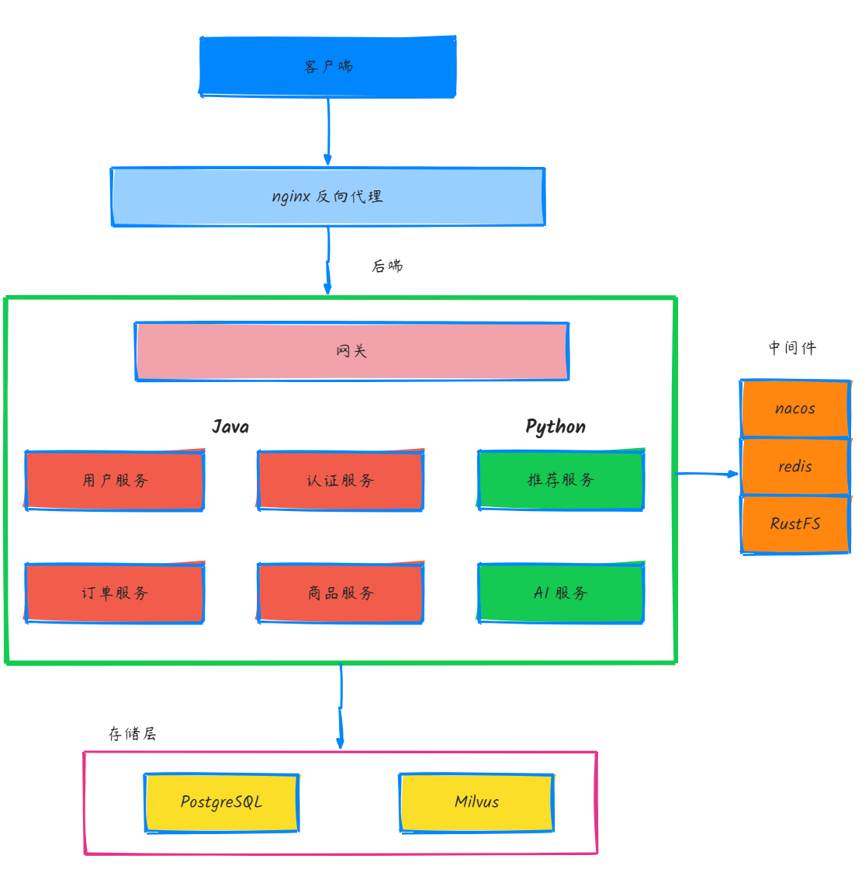

# ShopMind - AI 智能电商平台（前端）

ShopMind 是一个融合大语言模型（LLM）能力的智能电商平台，致力于通过 AI 技术提升用户的购物体验和商家的运营效率。

## 核心特性

### 🤖 AI 智能导购助手

- **自然语言交互**：用户可以用自然语言描述需求，AI 助手理解意图并推荐合适的商品
- **短期记忆**：AI 助手能够记住最近的对话内容，保持上下文连贯性，实现多轮对话
- **流式输出**：实时流式输出 AI 回复，提供流畅的对话体验
- **工具调用**： 支持调用搜索、新品获取、RAG 问答等工具，回答用户问题
- **商品链接跳转**：AI 推荐的商品可直接点击跳转到商品详情页

### 🎯 智能推荐系统

- **多维度向量融合**：结合用户兴趣、交互行为、搜索历史三大维度，生成个性化用户向量
- **行为权重计算**：对购买、加购物车、点赞、分享、浏览等行为赋予不同权重，精准刻画用户偏好
- **向量相似度检索**：基于 Milvus 向量数据库进行高效相似度搜索，实时推荐相关商品
- **智能去重过滤**：自动过滤已购买商品，避免重复推荐
- **冷启动支持**：新用户基于兴趣标签快速生成推荐，提升首次访问体验

### 🔍 混合智能搜索

- **LLM 增强搜索词**：利用大语言模型自动提取核心词和扩展词，解决语义稀释问题
- **关键词精准匹配**：基于 PostgreSQL 全文搜索 + jieba 分词器，支持复杂中文搜索场景
- **语义重排序**：通过 Milvus 向量检索对初步结果进行语义相似度排序，相关性最高的商品优先展示
- **混合搜索策略**：结合关键词精确度和语义相关性，平衡搜索结果的准确性和召回率
- **查询优化**：自动构建复杂查询表达式（核心词 AND，扩展词 OR），提升搜索效率

### 🛍️ 购物功能

- **智能搜索**：支持关键词搜索和语义搜索，快速找到心仪商品
- **商品浏览**：精美的商品展示页面，支持图片轮播、SKU 选择等
- **购物与订单**：完整的购物流程，支持订单管理和状态跟踪
- **地址管理**：完善的收货地址选择和管理功能

### 🏪 商家入驻

- **免费开店**：商家可免费入驻平台，发布和管理商品
- **商品管理**：支持商品的上传、编辑、删除等完整生命周期管理
- **AI 辅助**：AI 自动检查商品标题、图片合规性，并生成优质的商品描述
- **SKU 管理**：灵活的商品规格和库存管理

### 👤 用户中心

- **个人信息管理**：头像、昵称等个人信息设置
- **订单管理**：查看订单详情、订单状态跟踪
- **兴趣标签**：个性化兴趣标签设置，提升推荐精准度

## 技术栈

- Vue 3（组合式 API + `<script setup>`）
- Vite
- TypeScript
- Pinia（状态管理）
- Vue Router
- Element Plus（UI 组件库）
- Axios（HTTP 请求）

## 启动和构建命令

```bash
npm install

npm run dev

npm run build
```

## 部署（Nginx）

### 构建

```bash
npm run build
# 在项目根目录执行
docker build -t shopmind-frontend:latest .
```

### 运行容器

```bash
# 假设你用的 wls2 ，你要执行以下命令，关闭 Apach2 服务，因为它占用了 80 端口
sudo systemctl stop apache2
# 假设网络名为 shopmind-network
docker run -d \
  --name shopmind-frontend \
  --network shopmind-dev-net \
  -p 80:80 \
  shopmind-frontend:latest
```

# ShopMind - AI 智能电商平台（后端）
后端使用 Java + Python 混合架构，各自负责不同的服务功能划分，共享中间件和数据库的使用：



### 架构说明

#### 基础设施层
- **Nginx**：部署前端，作为整个项目的统一入口
- **网关**：Java Spring Cloud Gateway，负责具体的服务 IP 路由、统一服务异常处理等

#### 业务服务层

| 服务 | 技术栈 | 功能描述 | 详细文档 |
|------|--------|----------|----------|
| **推荐服务** | Python | 从多个维度对用户进行首页个性化商品推荐以及商品详情页"猜您喜欢"推荐 | [查看详情](https://github.com/hcy1-88/shopmind-recommendation-service) |
| **AI 服务** | Python | 负责大模型相关的交互任务，支持 AI chat、文本嵌入、RAG、商品标题图片智能审核、AI 商品文案生成 | [查看详情](https://github.com/hcy1-88/shopmind-ai-service) |
| **用户服务** | Java | 负责处理用户相关信息，如用户个人资料、用户收货地址、兴趣爱好、行为历史，用于个性化推荐 | [查看详情](https://github.com/hcy1-88/shopmind-user-service) |
| **认证服务** | Java | 作为整个项目的统一 token 权限认证，负责注册、登录、短信验证码、公钥发布 | [查看详情](https://github.com/hcy1-88/shopmind-auth-service) |
| **商品服务** | Java | 商品的智能搜索、商家服务 | [查看详情](https://github.com/hcy1-88/shopmind-product-service) |
| **订单服务** | Java | 下单、查询订单（暂未实现支付、物流等复杂业务） | [查看详情](https://github.com/hcy1-88/shopmind-order-service) |

#### 底层框架
- **公共框架**：基于 Spring Cloud 和 Spring Boot，为上游业务提供统一的公共能力
  - 功能包括：统一的 trace id 追踪、用户上下文、异常处理、中间件集成、token 检验、负载均衡、远程服务调用等
  - 方便业务人员聚焦于业务实现，节省心智模型
  - 📖 [详细说明](https://github.com/hcy1-88/shopmind-commen-starter)

项目在线访问地址：http://124.223.73.34/

详细笔记请参阅【项目详细笔记】。

# 📚 项目详细笔记

详细的项目开发笔记和技术文档请查看：[《ShopMind 项目笔记》](https://www.yuque.com/zhonghuajiadexiaoh/vl8u6g/xqqbgo6c9rygfh9t?singleDoc# 《项目笔记》)
